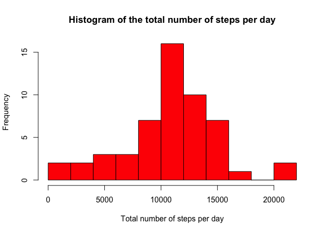
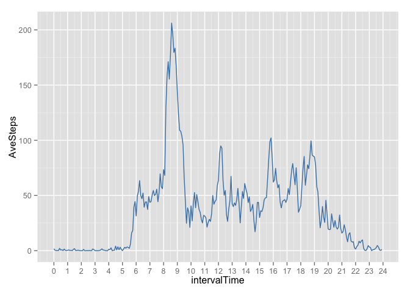
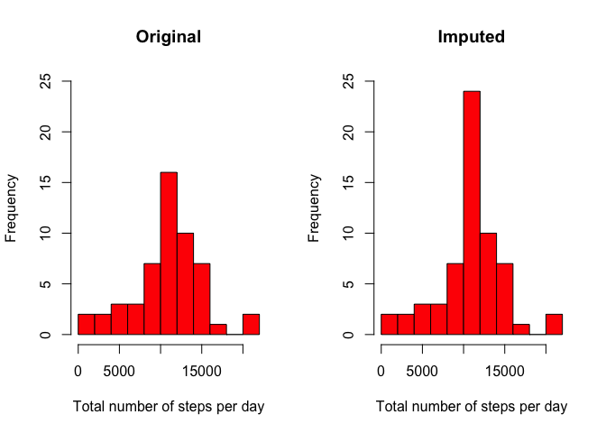
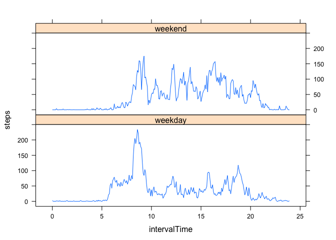

# Reproducible Research: Peer Assessment 1

First, check whether the activity file has been unzipped. If not, unzip it.


```r
if (!file.exists("activity.csv")) {
        unzip("activity.zip")
}
```
  
### Loading and preprocessing the data
  
As a first step, load the data using read.csv:
  

```r
act_data <- read.csv("activity.csv")
```
  
Then, have a look at the data to see if something needs to be done. 
  

```r
str(act_data)
```

```
## 'data.frame':	17568 obs. of  3 variables:
##  $ steps   : int  NA NA NA NA NA NA NA NA NA NA ...
##  $ date    : Factor w/ 61 levels "2012-10-01","2012-10-02",..: 1 1 1 1 1 1 1 1 1 1 ...
##  $ interval: int  0 5 10 15 20 25 30 35 40 45 ...
```

```r
summary(act_data)
```

```
##      steps                date          interval     
##  Min.   :  0.00   2012-10-01:  288   Min.   :   0.0  
##  1st Qu.:  0.00   2012-10-02:  288   1st Qu.: 588.8  
##  Median :  0.00   2012-10-03:  288   Median :1177.5  
##  Mean   : 37.38   2012-10-04:  288   Mean   :1177.5  
##  3rd Qu.: 12.00   2012-10-05:  288   3rd Qu.:1766.2  
##  Max.   :806.00   2012-10-06:  288   Max.   :2355.0  
##  NA's   :2304     (Other)   :15840
```
  
There seem to be quite a few NAs in the data and the values in the "interval"" variable are quite high. Indeed, a closer look at the first 15 values of this variable suggests that its format might not be ideal.
  

```r
head(act_data, 15)
```

```
##    steps       date interval
## 1     NA 2012-10-01        0
## 2     NA 2012-10-01        5
## 3     NA 2012-10-01       10
## 4     NA 2012-10-01       15
## 5     NA 2012-10-01       20
## 6     NA 2012-10-01       25
## 7     NA 2012-10-01       30
## 8     NA 2012-10-01       35
## 9     NA 2012-10-01       40
## 10    NA 2012-10-01       45
## 11    NA 2012-10-01       50
## 12    NA 2012-10-01       55
## 13    NA 2012-10-01      100
## 14    NA 2012-10-01      105
## 15    NA 2012-10-01      110
```
  
In order to transform it to an appropriate time variable, first pad it with zeros on the left so that all the values of the same length. 
  

```r
interval_padding <- formatC(act_data$interval, width=4, flag="0")
```
  
After transforming it to an anambigous time format in "int_aux", the relevant hour and minute component are extracted using the lubridate package and saved in a column of the data frame.
  

```r
int_aux <- paste(act_data$date, paste(substr(interval_padding,0,2), substr(interval_padding,3,4), sep = ":"))

library(lubridate)
act_data$intervalTime <- hour(int_aux) + minute(int_aux)/60
```
  
    
### What is the mean total number of steps taken per day?

This question is addressed in three steps.  
First, the total number of steps is calculated for each day using the aggregate function. This function can be called in the two following ways: 


```r
num_steps_perDay <- aggregate(act_data[ , 1], list(act_data$date), sum)
names(num_steps_perDay) <- c("Days", "NumberSteps")
```

or


```r
num_steps_alt <- aggregate(steps ~ date, act_data, sum)
```

which automatically adds the variable names.    

Second, these data are visualized via a histogram plot. This time the base system is used for that.


```r
hist(num_steps_perDay$NumberSteps, col = "red", xlab = "Total number of steps per day", 
     main = "Histogram of the total number of steps per day", breaks = 10)
```

 

Third, the mean and the median total number of steps taken per day are calculated.


```r
mean_across_days <- mean(num_steps_perDay$NumberSteps, na.rm = TRUE)
median_across_days <- median(num_steps_perDay$NumberSteps, na.rm = TRUE)
```

The mean and median are 10766.2 and 10765, respectively. In this case they do not differ much from each other. As a check, let's plot one of them together with the histogram. 


```r
hist(num_steps_perDay$NumberSteps, col = "red", xlab = "Total number of steps per day",
     main = "Histogram of the total number of steps per day", breaks = 10)
abline(v = mean_across_days, col = "blue", lwd = 2)
```

 

One can see that the mean actually overlaps with the bin with more observations, as expected.  
  
### What is the average daily activity pattern?
    
Again, let's use the aggregate function to calculate the average number of steps taken per 5-minute interval.
  

```r
ave_perMin_acrossDays <- aggregate(act_data[ , 1], list(act_data$intervalTime), mean, na.rm = TRUE)
names(ave_perMin_acrossDays) <- c("intervalTime", "AveSteps")
```

And now let's visualize this variable in a plot, this time using ggplot. 


```r
library("ggplot2")
p <- ggplot(ave_perMin_acrossDays, aes(x = intervalTime, y = AveSteps))
p + geom_line(col = "steelblue") + scale_x_continuous(breaks = 0:24)
```

 

By looking at the plot, one can see that this person starts making some steps around 5h30, more or less, probably at the time that she/he wakes up and that there is a peak between 8am and 9am. Maybe the person goes jogging around that time. To know exactly at which 5 min interval the maximum number of steps occur, the maximum is calculated:


```r
max_index <- which.max(ave_perMin_acrossDays$AveSteps)
max_interval <- act_data$interval[max_index]

max_interval_hour_low <- paste(substr(max_interval-5,0,1), substr(max_interval-5,2,3), sep = ":")
max_interval_hour_upper <- paste(substr(max_interval,0,1), substr(max_interval,2,3), sep = ":")
```

The 5-minute interval that contains the maximum number of steps is 835, i.e. between 8:30 and 8:35 am.


### Imputing missing values

First, we compute the number of NA rows using the complete.cases function.


```r
num_NArows <- sum(!complete.cases(act_data))
```

The total numver of NA is 2304.  
In order to have an idea on how these NA values are distributed, I compute a data frame without missing values and compare the summary information from the date column with the original data frame.


```r
data_complete <- act_data[which(complete.cases(act_data)), ]
summary(act_data$date)
```

```
## 2012-10-01 2012-10-02 2012-10-03 2012-10-04 2012-10-05 2012-10-06 
##        288        288        288        288        288        288 
## 2012-10-07 2012-10-08 2012-10-09 2012-10-10 2012-10-11 2012-10-12 
##        288        288        288        288        288        288 
## 2012-10-13 2012-10-14 2012-10-15 2012-10-16 2012-10-17 2012-10-18 
##        288        288        288        288        288        288 
## 2012-10-19 2012-10-20 2012-10-21 2012-10-22 2012-10-23 2012-10-24 
##        288        288        288        288        288        288 
## 2012-10-25 2012-10-26 2012-10-27 2012-10-28 2012-10-29 2012-10-30 
##        288        288        288        288        288        288 
## 2012-10-31 2012-11-01 2012-11-02 2012-11-03 2012-11-04 2012-11-05 
##        288        288        288        288        288        288 
## 2012-11-06 2012-11-07 2012-11-08 2012-11-09 2012-11-10 2012-11-11 
##        288        288        288        288        288        288 
## 2012-11-12 2012-11-13 2012-11-14 2012-11-15 2012-11-16 2012-11-17 
##        288        288        288        288        288        288 
## 2012-11-18 2012-11-19 2012-11-20 2012-11-21 2012-11-22 2012-11-23 
##        288        288        288        288        288        288 
## 2012-11-24 2012-11-25 2012-11-26 2012-11-27 2012-11-28 2012-11-29 
##        288        288        288        288        288        288 
## 2012-11-30 
##        288
```

```r
summary(data_complete$date)
```

```
## 2012-10-01 2012-10-02 2012-10-03 2012-10-04 2012-10-05 2012-10-06 
##          0        288        288        288        288        288 
## 2012-10-07 2012-10-08 2012-10-09 2012-10-10 2012-10-11 2012-10-12 
##        288          0        288        288        288        288 
## 2012-10-13 2012-10-14 2012-10-15 2012-10-16 2012-10-17 2012-10-18 
##        288        288        288        288        288        288 
## 2012-10-19 2012-10-20 2012-10-21 2012-10-22 2012-10-23 2012-10-24 
##        288        288        288        288        288        288 
## 2012-10-25 2012-10-26 2012-10-27 2012-10-28 2012-10-29 2012-10-30 
##        288        288        288        288        288        288 
## 2012-10-31 2012-11-01 2012-11-02 2012-11-03 2012-11-04 2012-11-05 
##        288          0        288        288          0        288 
## 2012-11-06 2012-11-07 2012-11-08 2012-11-09 2012-11-10 2012-11-11 
##        288        288        288          0          0        288 
## 2012-11-12 2012-11-13 2012-11-14 2012-11-15 2012-11-16 2012-11-17 
##        288        288          0        288        288        288 
## 2012-11-18 2012-11-19 2012-11-20 2012-11-21 2012-11-22 2012-11-23 
##        288        288        288        288        288        288 
## 2012-11-24 2012-11-25 2012-11-26 2012-11-27 2012-11-28 2012-11-29 
##        288        288        288        288        288        288 
## 2012-11-30 
##          0
```

As one can see, the new data frame has seven days without any values, while the other days appear to have all the data. Hence, the NAs actually correspond to days for which the data is completely missing. Arguably, the more straightforward solution would be to impute these values by using the mean for the 5-minute interval across the remaining days.  
I define a new variable "data_imp" to which I copy the original data frame and calculate which are the days without data in the "impute_days" variable. I then use a for loop to replace those values with the mean for the 5-minute intervals that I computed before.


```r
data_imp <- act_data
sum_act_data <- summary(data_complete$date)

impute_days <- names(sum_act_data)[which(sum_act_data == 0)]

for (num_days in seq_along(impute_days)){
        data_imp[which(data_imp$date == impute_days[[num_days]]), 1] <- ave_perMin_acrossDays$AveSteps   
}
```

After computing the new averaged total number of steps per day value, let's plot the new histogram next to the original histogram to see what changed.


```r
num_steps_perDay_imp <- aggregate(data_imp[ , 1], list(data_imp$date), sum)
names(num_steps_perDay_imp) <- c("Days", "NumberSteps")

par(mfrow = c(1,2))
hist(num_steps_perDay$NumberSteps, col = "red", xlab = "Total number of steps per day", main = "Original", breaks = 10, ylim=c(0,25))

hist(num_steps_perDay_imp$NumberSteps, col = "red", xlab = "Total number of steps per day", main = "Imputed", breaks = 10, ylim=c(0,25))
```

 

As one can see, imputing resulted in an increase of the number observations in the "mean bin".  
Let's now see how this affected the mean and the median values. 


```r
mean_across_days_imp <- mean(num_steps_perDay_imp$NumberSteps)
median_across_days_imp <- median(num_steps_perDay_imp$NumberSteps)
```

The mean and median from the imputed data set are 10766.2 and 10766.2, respectively. As expected, the mean did not change, and the median was shifted towards the mean, because we added so many new data corresponding to the mean value. While the difference in this case is not very big, one needs to be careful with imputing values, as this can change relations between variables.


### Are there differences in activity patterns between weekdays and weekends?

First, I add a variable to the data frame that encondes whether a day is a weekday or a weekend day.


```r
days_aux <- weekdays(as.Date(act_data$date, "%Y-%m-%d"))
act_data$weekDays <-sapply(days_aux, function(x) if(any(x == c("Saturday", "Sunday"))) {"weekend"} else {"weekday"})
```

Then I divide the weekdays and weekend data into two data frames, I use the aggregate function to calculate the average per 5 min interval for each category and I combine them again in the variable called "ave_weekDays".


```r
data_weekdays <- act_data[which(act_data$weekDays == "weekday"), ]
data_weekend <- act_data[which(act_data$weekDays == "weekend"), ]

mean_weekdays <- aggregate(steps ~ intervalTime, data_weekdays, mean, na.rm = TRUE)
mean_weekdays$weekDays <-"weekday"

mean_weekend <- aggregate(steps ~ intervalTime, data_weekend, mean, na.rm = TRUE)
mean_weekend$weekDays <-"weekend"

ave_weekDays <- rbind(mean_weekdays,mean_weekend)
ave_weekDays <- transform(ave_weekDays, weekDays = factor(weekDays)) 
```

Now I use the lattice package to do the plot.


```r
library("lattice")
xyplot(steps ~ intervalTime | weekDays, data = ave_weekDays, type = "l", layout = c(1, 2))
```

 

By looking at the plots one can see that on weekdays the person starts walking around a bit earlier than on week days. On the other hand, on weekends the person walks more around in the evening compared to week days. In general, there seems to be more activity during weekends than during week days, which would make sense, if the person has a desk job and therefore spends most of the day sitting during week days.
